# ShowGalaxy
An Android movie and TV show app which is capable of browsing movies and TV shows. ShowGalaxy also provides an interface to search movies, TV shows and people. The data used by ShowGlaxy is powered by [The Movie Database(TMDb)](https://www.themoviedb.org/).

*To compile this project yourself, you need to provide TMDb API key. Please specify your key in com.mas.showgalaxy.model.ConfigureInfo class.*

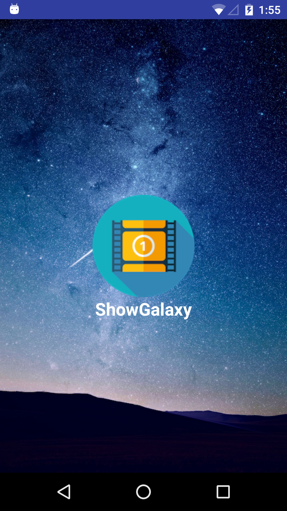

# What It Can Do
The goal of this app is to provide an interface for users to browse movies and TV shows. Users can also search movies, TV shows and people. 

* Movie and TV show browsing
	1. Movies and TV shows fall into four categories including now playing, pouplar, coming soon and top rated.
	2. Movies and TV shows display in a list view and users can click to see the detail of the show.
	3. The detail information of each show contains relases date, running time, average score, popularity, overview, etc. Posters and trailers are also available, as well as the casts and crews. For a TV show, there is an extra season information.
	
* Show and people searching
	1. Users can search movies and TV shows
	2. Users can search people, for example, an actor or actress
	
# Screenshots
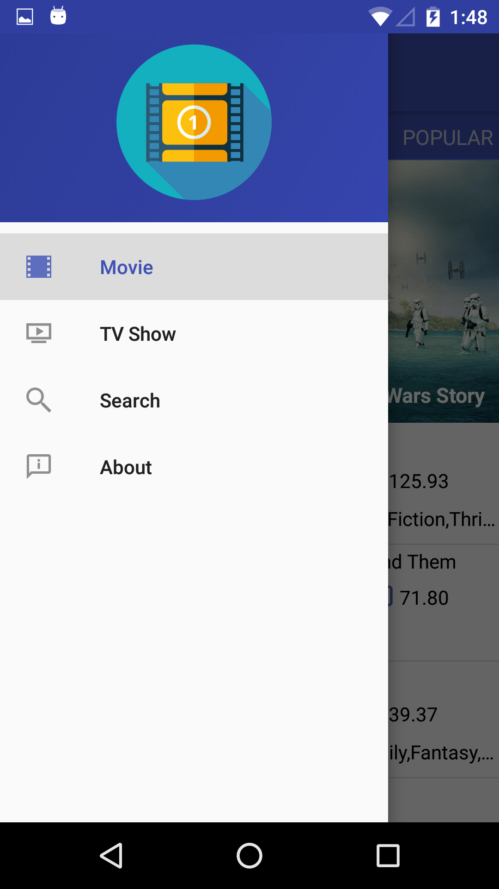
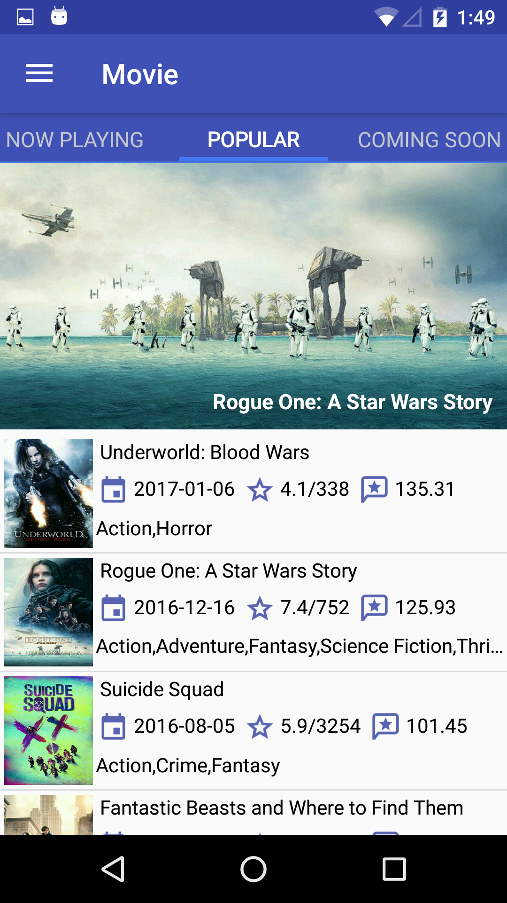
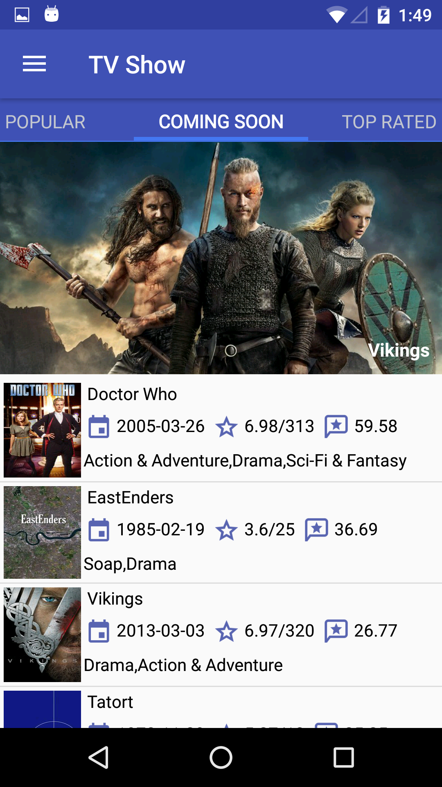

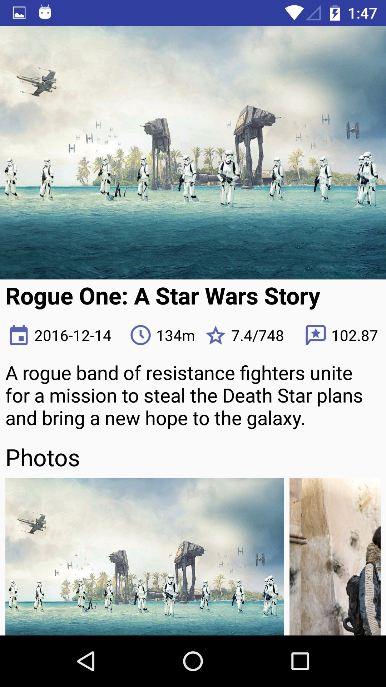
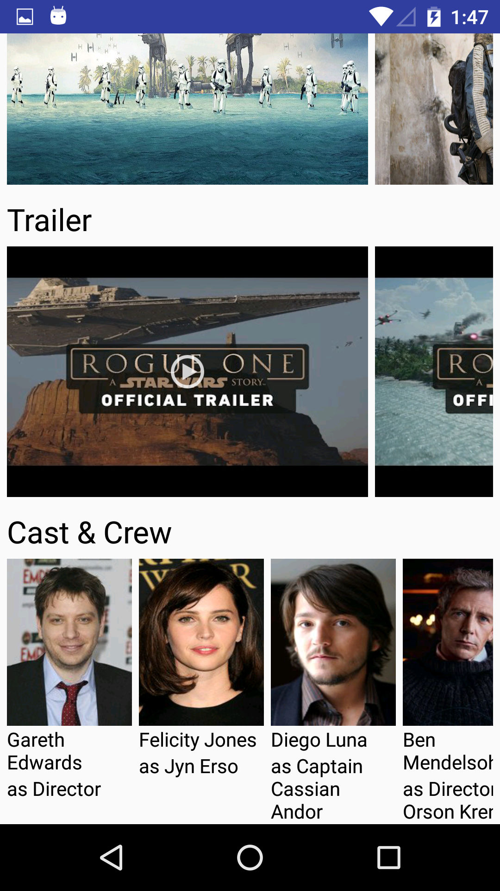
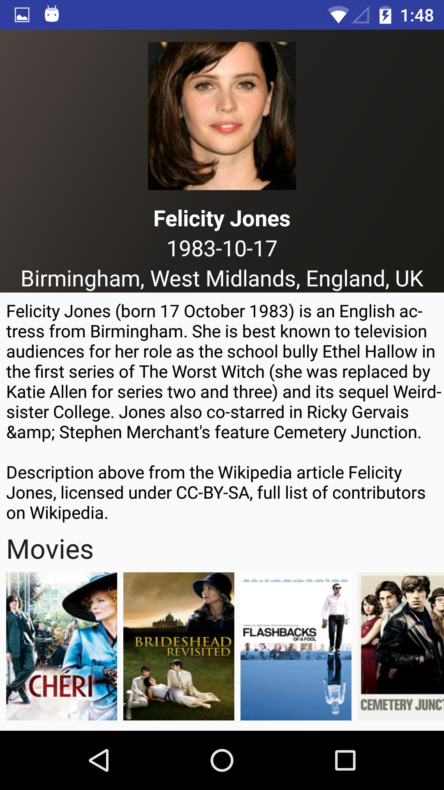

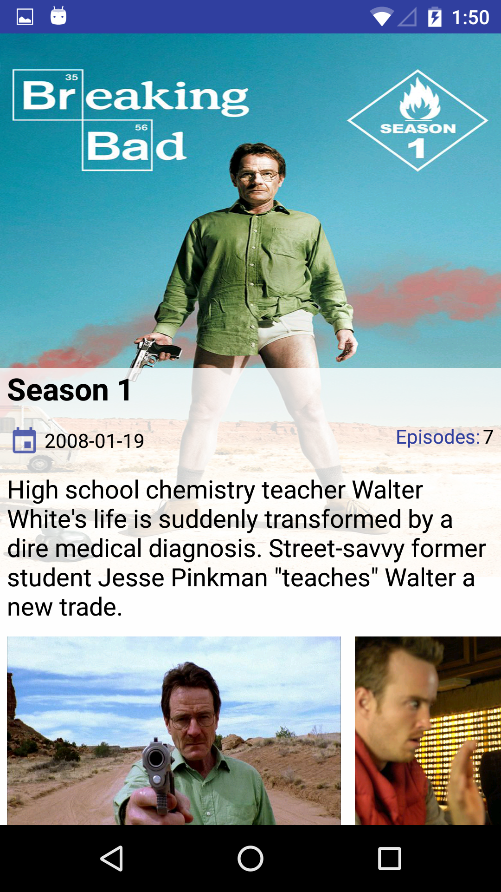
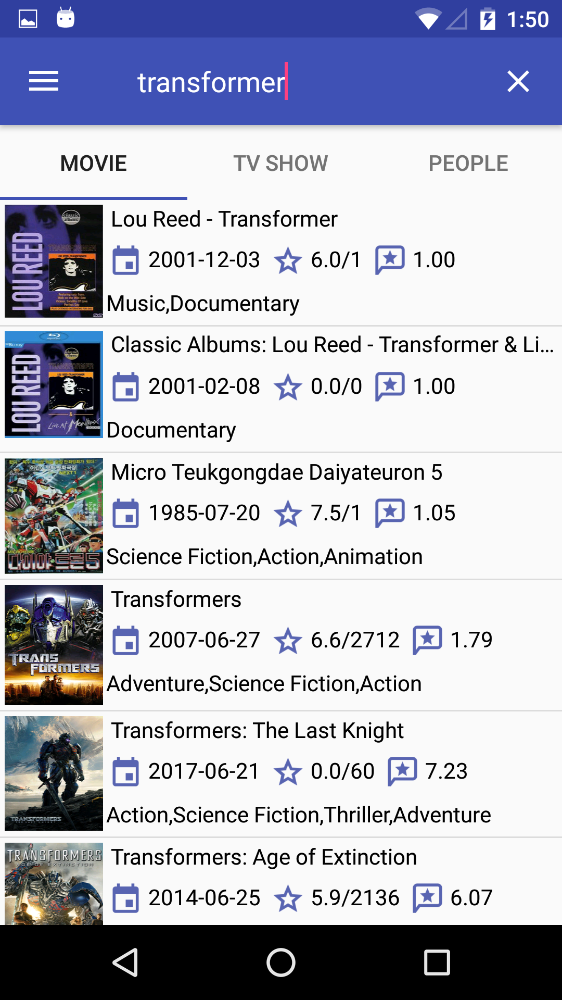
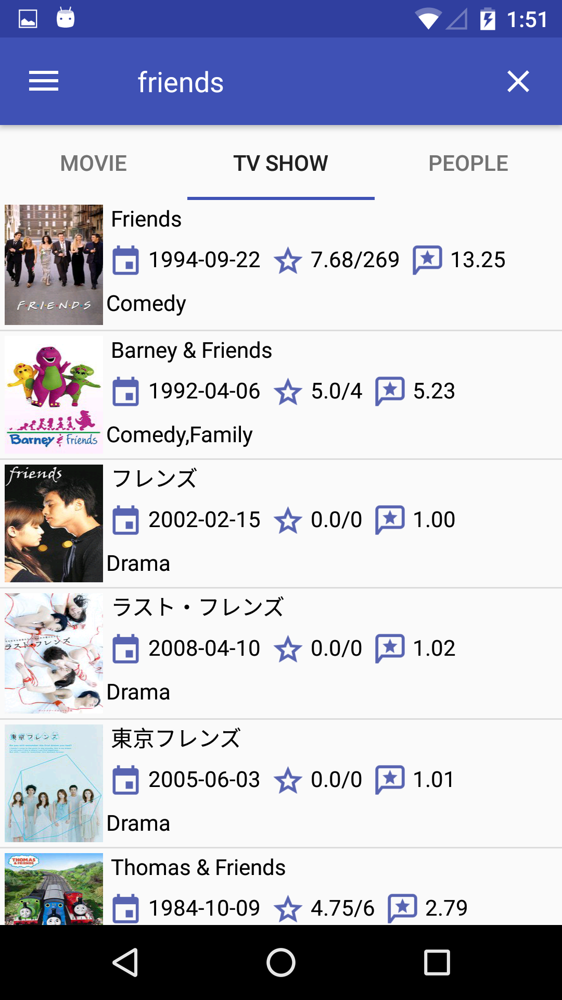

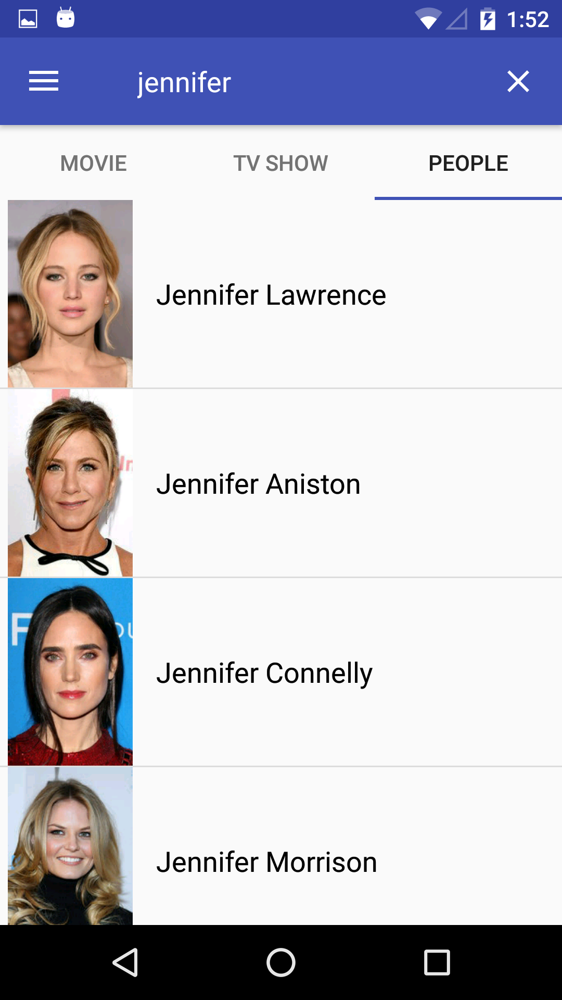

# Dependencies
* [Volley](https://developer.android.com/training/volley/index.html)
* [glide](https://github.com/bumptech/glide)
* [ViewPageIndicator](https://github.com/JakeWharton/ViewPagerIndicator)
* [ViewPagerTransforms](https://github.com/ToxicBakery/ViewPagerTransforms)
* [MaterialProgressBar](https://github.com/DreaminginCodeZH/MaterialProgressBar)

# Credits
* ShowGalaxy app logo is made by <a href=>[Dimi Kazak](http://www.flaticon.com/authors/dimi-kazak) from [FlatIcon](http://www.flaticon.com)
* All other icons are from [Icons8](https://icons8.com)

# License

Copyright 2016 Shuang Ma & Wenjun Hu

Licensed under the Apache License, Version 2.0 (the "License");
you may not use this file except in compliance with the License.
You may obtain a copy of the License at

   http://www.apache.org/licenses/LICENSE-2.0

Unless required by applicable law or agreed to in writing, software
distributed under the License is distributed on an "AS IS" BASIS,
WITHOUT WARRANTIES OR CONDITIONS OF ANY KIND, either express or implied.
See the License for the specific language governing permissions and
limitations under the License.

